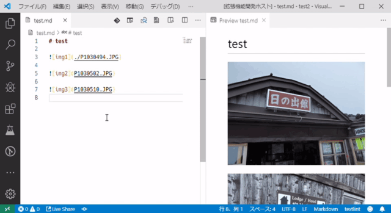
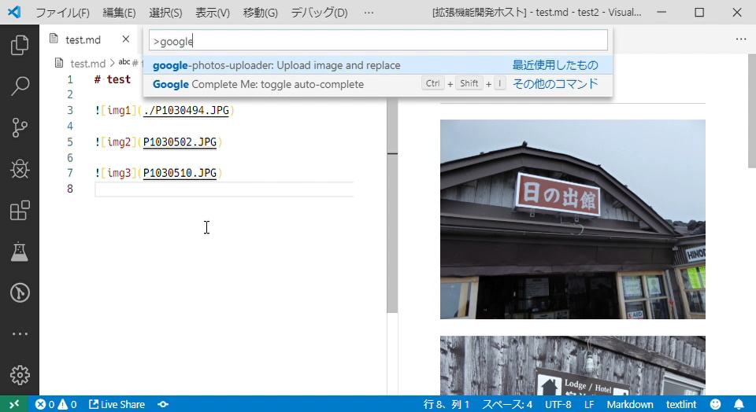
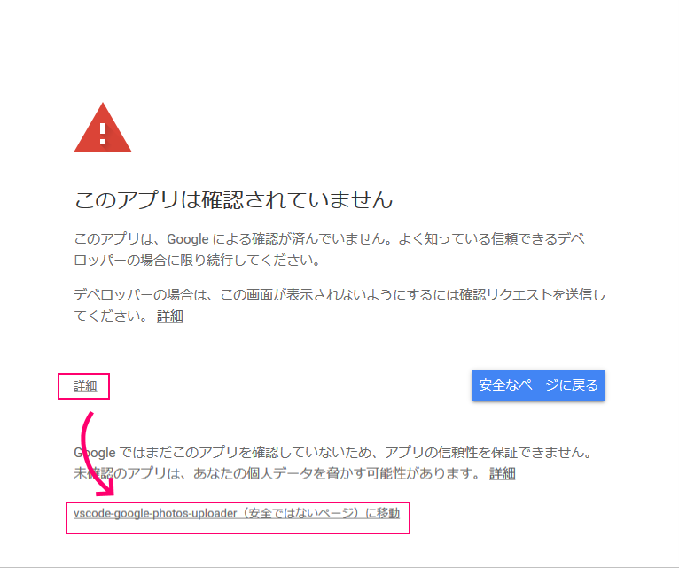
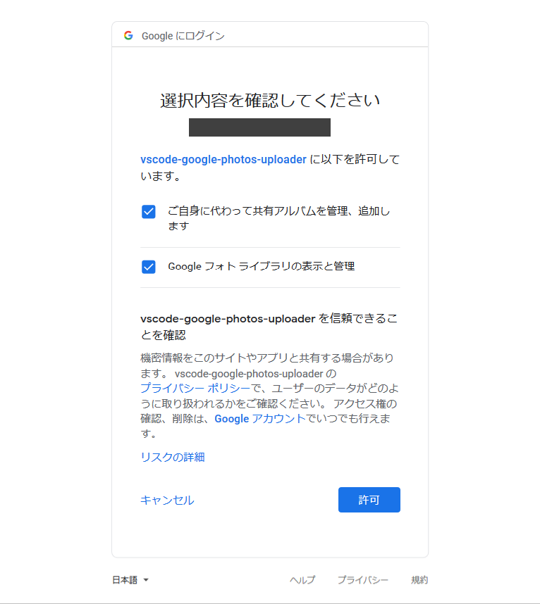
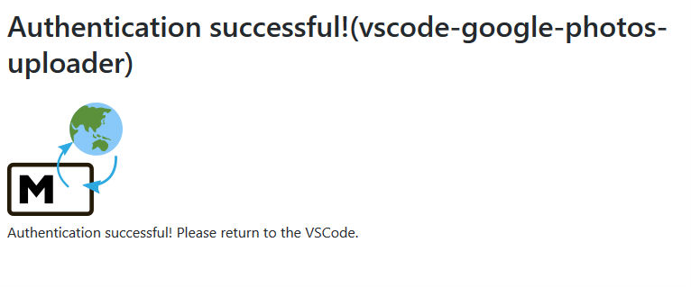
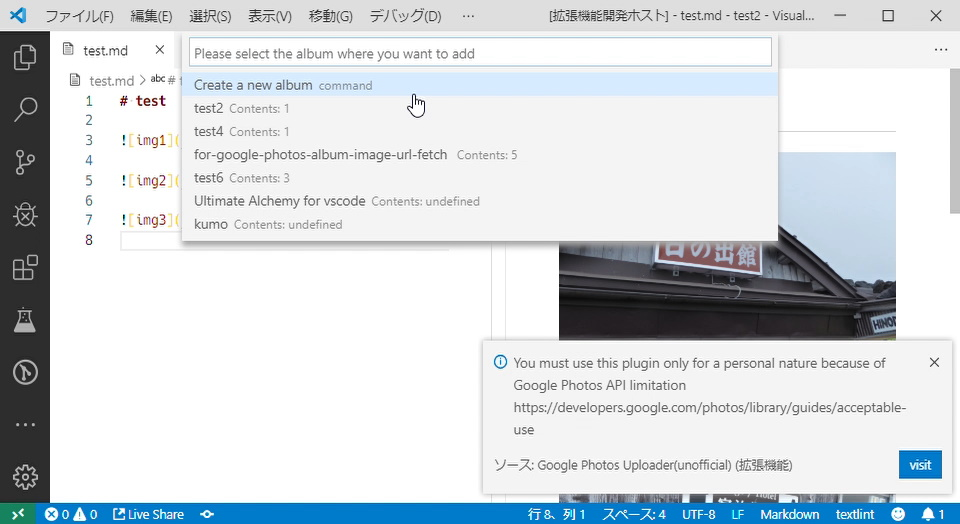
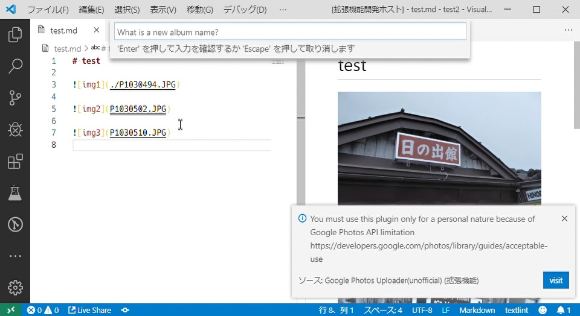
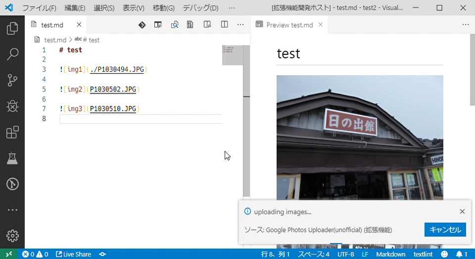
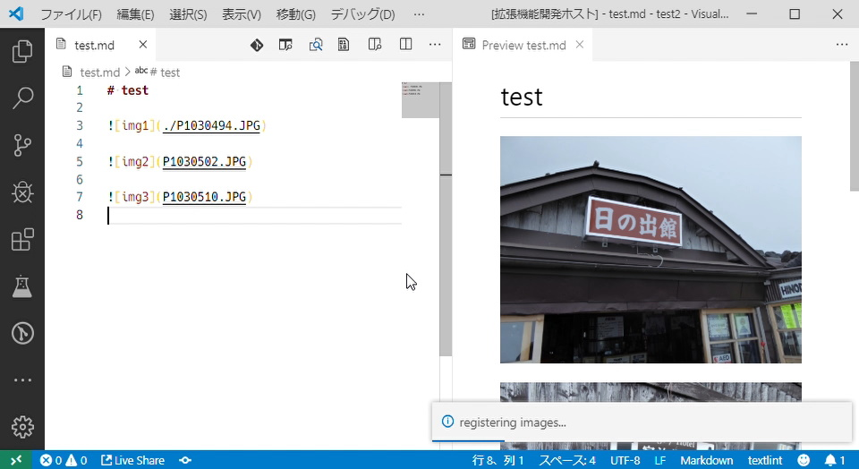
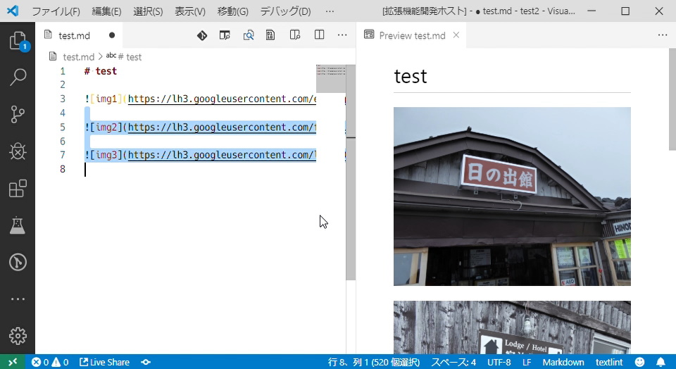

# google-photos-uploader


This extension just provides `google-photos-uploader: Upload image and replace` command.

The command will do all the step shown below:

1. extract img path from your **markdown** text
2. upload to [Google Photos](https://www.google.com/photos/about/)
3. replace img path to Google Photos published url

Keep in mind that this plugin will publish all images the target markdown file referencing to all over the world.



## How to use

### Run command

Open command palet(`Ctrl`+`Shift`+`P`), find `google-photos-uploader: Upload image and replace` command and execute.



### (OAuth)

This plugin sometimes request you OAuth2 Authentication.

In this case, default browser will be started.

1. Select Google acount and login  

2. App verification is now in progress. Until I receive Google's response, please ignore this warning to continue when you think this plugin is reliable.  

3. Authorize these parmissions.  
  

4. Authorize these parmissions again!(I don't know why authorize phase are duplicated)  

5. Sucess! Go back to vscode.  


## Select Album

Because of Google Photos API limitation, albums you can add photos must be created by this plugin.

So, you have 3 choices to upload images.

1. I don't want to add photos to albums: not tested
2. create a new album
3. select album already created by this plugin



When you chose `create a new album`, you need to specify the new album name.



## Please wait for seconds

On this phase, this plugin executes below:

1. extract image path
2. upload image (depend on the total image size and your traffic speed, showing progress info)
3. register images to the album
4. get published image URL
5. replace image path to the URL







## Known Issue

Because of [pulldown-cmark-to-cmark](https://crates.io/crates/pulldown-cmark-to-cmark) limitation, all code block will be replaced like below:

`before`:

    ```typescript
    console.log("arikitari na sekai");
    ```

`after`:

    ````typescript
    console.log("arikitari na sekai");
    ````

Almost all cases, that is no problem because HTML converted result will be equal.

However, in some cases, the replaced result will be broken.

`before`:

``````markdown
`````markdown
````markdown
```typescript
console.log("arikitari na sekai");
```
````
`````
``````

`after`:

    ````markdown
    ````markdown
    ```typescript
    console.log("arikitari na sekai");
    ```
    ````
    ````
